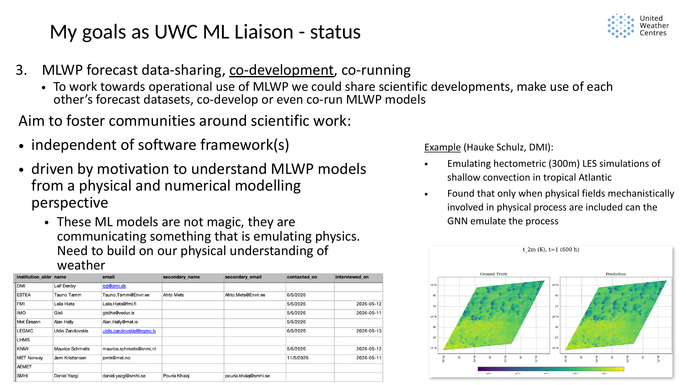

Machine-learning weather prediction is moving quickly. Global models such as
AIFS, GraphCast, Pangu-Weather, Aurora, and others have made it clear that
data-driven forecasting is no longer a distant research idea. At the same time,
the path from an impressive forecast demo to something meteorological services
can trust, evaluate, adapt, and operate is still being worked out.

That is the context for the UWC ML Liaison role.

This site is intended as a public working notebook for that role: a place to
share what I am learning, what projects are moving, what questions are still
open, and where collaboration around machine-learning weather prediction (MLWP)
might be useful.

## What I Think The Role Is

The formal call for the role described it as advising UWC partners looking to
expand their involvement in ML development, guiding their integration into
broader European efforts, and identifying and coordinating ML-enabling
activities within UWC that could support the wider evolution of data-driven
forecasting capabilities.

That is a broad remit. I am the first person in this role, so part of the work is
still to discover what it should become in practice.

My current interpretation is this: the ML Liaison role should help UWC and its
partners make good collective decisions about MLWP. That means helping the
community understand the scientific frontier, build shared ways of evaluating
models, and create practical routes for data-sharing, tooling, and
co-development.

It is not only about following model scores. It is about asking what would make
MLWP scientifically credible, operationally useful, and maintainable as part of a
weather-service ecosystem.

{fig-alt="Presentation slide titled 'What is a ML Liaison Officer?', showing excerpts from the job call and the role's relationship to research-to-operations and operations-to-research." width="100%"}

## Why Coordination Matters

Numerical weather prediction has always depended on a tight connection between
scientific research and operational implementation. UWC exists in that tradition:
collaborative scientific development, operational modelling systems, and the
exchange between research-to-operations and operations-to-research.

MLWP changes the technical landscape, but it does not remove the need for that
connection. If anything, it makes coordination more important, because many
transitions are happening at once:

- from equation-based NWP towards data-driven or hybrid forecasting
- from separate analysis and forecast steps towards ML data assimilation or
  direct-from-observations forecasting
- from compute-intensive forecasts towards cheap inference and expensive
  training
- from GRIB-based forecast datasets towards Zarr and cloud-native data
- from scientific Fortran towards scientific Python
- from closed-source modelling systems towards open-source components
- from hand-coded software development towards more agent-assisted workflows

{fig-alt="Presentation slide titled 'Many concurrent transitions', contrasting NWP, analysis/forecast separation, GRIB, Fortran, closed-source software, and hand-coded development with MLWP, ML data assimilation, Zarr, Python, open source, and agent-based development." width="100%"}

None of these transitions is isolated. Choices about data formats affect
verification. Choices about software structure affect whether scientists can
experiment. Choices about model architecture affect whether the model can be
understood, diagnosed, and improved.

The liaison role should help keep those connections visible.

## What Operational MLWP Will Need

For MLWP to become operationally useful, I think at least five things matter.

First, the whole toolchain must be maintainable: dataset preparation, training,
inference, evaluation, and downstream use. A good model checkpoint is not enough
if the surrounding system cannot be understood, reproduced, or adapted.

Second, research and development should use tooling that gives scientists agency
to experiment. We do not yet know what the next useful ML architecture or
training approach will be. If the toolchain is too rigid, it will block the
research needed to improve it.

Third, input and output datasets need clear specifications. My current bias is
towards CF-compliant Zarr datasets where possible, because we need forecast data
that are easy to validate, share, inspect, and use across tools.

Fourth, forecast skill needs to be proven and reliable. That requires more than
one centre running its own private evaluation. We need community consensus and
reusable tooling around what should be measured and how.

Fifth, model development should remain grounded in weather physics. ML models
are not magic. If they forecast the atmosphere well, they are learning something
about atmospheric evolution. We should use physical and numerical understanding
to ask when that learning is meaningful, when it fails, and what changes might
make it better.

{fig-alt="Presentation slide titled 'Operational requirements to MLWP models', listing maintainable software, scientist agency, specified input and output formats, reliable skill, and physics-grounded model architectures." width="100%"}

## The Three Workstreams

I currently organise my work around three connected goals.

{fig-alt="Presentation slide titled 'My goals as UWC ML Liaison', listing the frontier for km-scale MLWP, operations-focused skill assessment, and MLWP forecast data-sharing, co-development, and co-running." width="100%"}

### 1. Establish The Frontier For Km-Scale MLWP

The first goal is to understand what is known about kilometre-scale ML weather
prediction from the published literature.

Which processes do current ML models represent well? Where do they fail? Are
they physically consistent? Can they represent geostrophic balance, stability,
convective rain, or cloud evolution? Can probabilistic or generative models
produce physically meaningful spatial structures?

This work is linked to a review article and a continually updated publication
overview at <https://leifdenby.github.io/kmscale-pubs/>.

### 2. Establish Operations-Focused Skill Assessment

The second goal is to help establish an operations-focused way of assessing
km-scale MLWP.

There is currently no widely accepted km-scale MLWP benchmark dataset for
weather forecasting. More importantly, there is not yet a shared answer to what
the community should accept from an ML weather model.

Pointwise scores are useful, but they are not enough. Operationally relevant
assessment also needs to consider extremes, spatial structure, reliability,
physical consistency, and behaviour in weather regimes that matter to
forecasters.

The intended outcome is a publicly available benchmark dataset with tooling for
formal verification.

### 3. Support Data-Sharing, Co-Development, And Co-Running

The third goal is to make practical collaboration easier.

If several meteorological services are generating MLWP forecasts, those forecasts
should not all sit in separate formats and separate storage systems with
separate bespoke tooling. A better route is shared forecast datasets, common
format validation, and reusable tools for loading, displaying, and verifying
forecasts.

{fig-alt="Presentation slide showing MLWP forecast models producing outputs in different formats and locations, contrasted with a shared object store on the European Weather Cloud containing forecasts in a common format with a validator." width="100%"}

This would let different centres build experience with different architectures
and trained models, compare them more systematically, and make better decisions
about where to collaborate.

This work also includes scientific community-building. I am especially
interested in MLWP from a physical and numerical modelling perspective: what
processes are represented, which variables matter, which architectures help, and
where the models break.

{fig-alt="Presentation slide titled 'MLWP forecast data-sharing, co-development, co-running', describing communities independent of software frameworks and motivated by understanding MLWP from a physical and numerical modelling perspective, with Hauke Schulz's LES/GNN shallow-convection example." width="100%"}

One motivating example is Hauke Schulz's work at DMI on emulating hectometric LES
simulations of shallow convection with graph neural networks. The central
question is not just whether the model has low error, but whether it can emulate
the physical process. In that case, the result points towards a useful principle:
the model only reproduces the process when the physical fields mechanistically
involved in that process are included.

That is the kind of question I think MLWP needs more of.

## What This Blog Is For

This blog will be a public synthesis layer over the liaison work.

It will include project updates, technical reflections, seminar announcements,
summaries of public work, and open questions for the community. It will not be a
public archive of private meeting notes, personal correspondence, institutional
positions, or unconfirmed commitments.

The intended audience is people working on MLWP in meteorological services and
nearby research communities: UWC first, but also E-AI, ACCORD, WMO-related
efforts, and the wider weather and machine-learning community.

## What I Hope This Enables

My working hypothesis is that the choices we make now about datasets, modelling
code, forecast outputs, verification tools, and downstream uses will shape what
MLWP can become operationally.

If we build on existing standards and the scientific Python ecosystem, keep the
systems open enough for experimentation, and design around shared use rather
than isolated demos, we improve the chance that today's work becomes robust
operational infrastructure rather than a collection of disconnected prototypes.

And if we let physics-based scientific research guide model development and
evaluation, we improve the chance that MLWP becomes not only skilful, but also
understandable and trustworthy.

Suggestions are welcome: papers, datasets, verification methods, physical-
process studies, seminar speakers, or collaboration ideas. See the
[Contact](../../contact.qmd) page.
