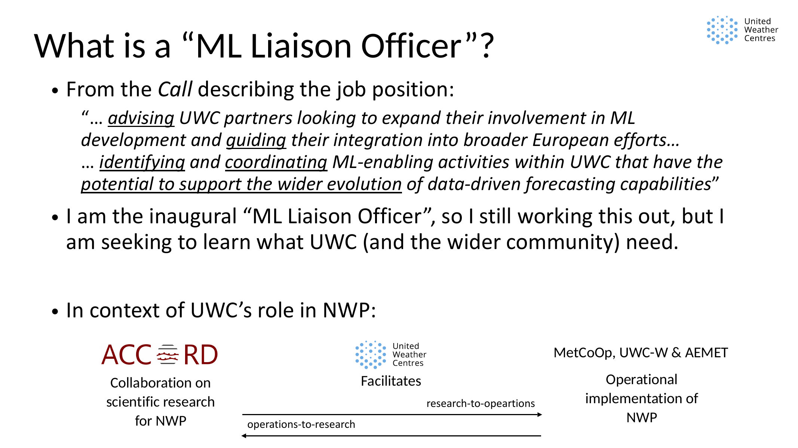
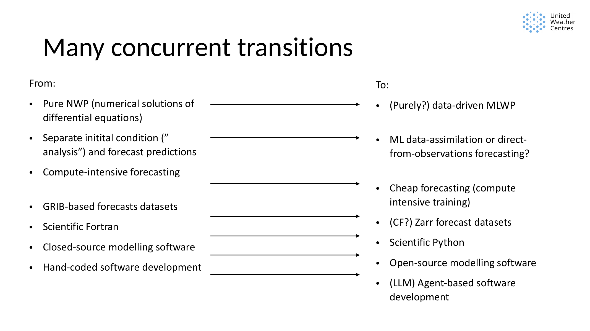
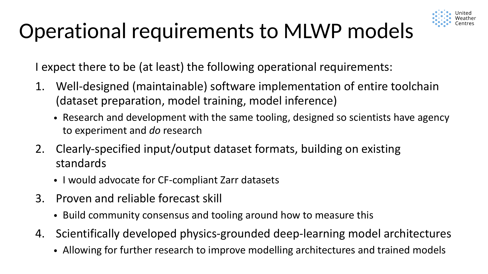
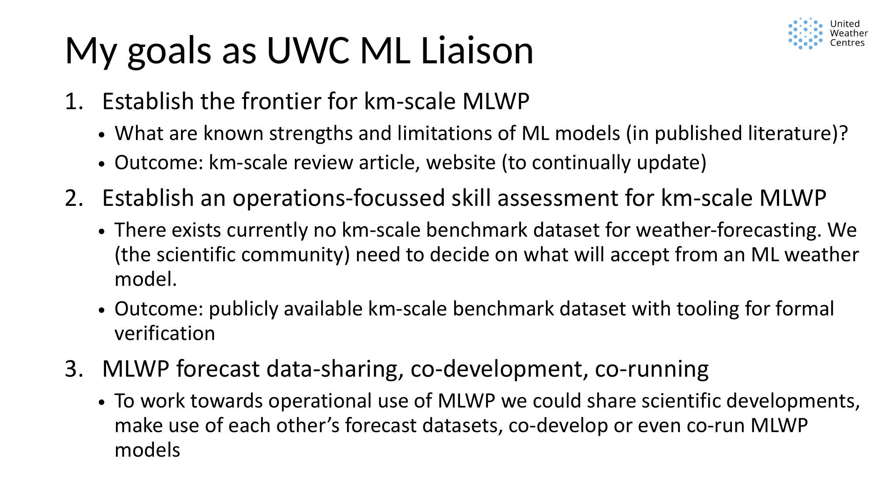
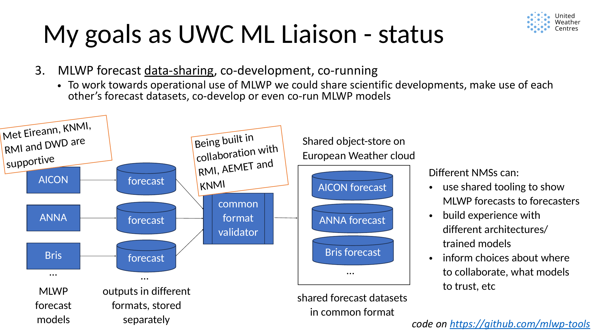

Machine-learning weather prediction (MLWP) is moving quickly. Global models such as
AIFS, GraphCast, Pangu-Weather, Aurora, and others have made it clear that
global resolution data-driven forecasting is no longer a distant research idea,
and many operational centres have already made operational or in the process of developing
regional (stretched-grid or limited-area) km-scale MLWP forecasting capabilities.
However, the path towards something that is operationally useful,
scientifically credible, and maintainable as part of a weather-service
ecosystem is still being worked out.

That is the context for the UWC ML Liaison role.

The UWC (United Weather Centers) is a collaboration between 11 European
meteorological services, with the goal of sharing scientific development,
operational modelling systems, and the exchange between research-to-operations
and operations-to-research. The ML Liaison role is a new position within UWC,
created to help coordinate the development and operationalisation of MLWP
across the member services. And I am activitely contributing in the [EUMETNET
E-AI programme](https://eumetnet-e-ai.github.io/), and the ECMWF Machine
Learning Pilot Project within it, to foster collobaration not just within UWC
but also across the wider European weather and machine-learning community.

I am intending for this website to be a public working notebook for that role:
a place to share what I am learning, what projects are moving, what questions
are still open, and where I think collaboration around MLWP could be most useful.

## So what is the ML Liaison role?

The formal call for the role described it as "advising UWC partners looking to
expand their involvement in ML development, guiding their integration into
broader European efforts, ... and identifying and coordinating ML-enabling
activities within UWC that could support the wider evolution of data-driven
forecasting capabilities."

That is a broad remit, and I am adjusting my focus based on feedback from the
UWC members and the evolving landscape of MLWP.
I am the first person in this role, so part of the work is
still to discover what it should become in practice.

My interpretation is this: the ML Liaison should enable UWC members to make
good collective decisions about machine-learning based weather forecasting to
ensure we can fulfill our operational obligations. To me, that means helping
the community understand the scientific frontier, build shared ways of
evaluating models, and create practical routes for data-sharing, tooling, and
co-development.

It is not only about following model scores. It is about asking what would make
MLWP scientifically credible, operationally useful, and maintainable as part of a
weather-service ecosystem.

{fig-alt="Presentation slide titled 'What is a ML Liaison Officer?', showing excerpts from the job call and the role's relationship to research-to-operations and operations-to-research." width="100%"}

## Why cross-institutional coordination matters

Numerical weather prediction has always depended on a tight connection between
scientific research and operational implementation. UWC exists in that tradition:
collaborative scientific development, operational modelling systems, and the
exchange between research-to-operations and operations-to-research.

MLWP changes the technical landscape, but it does not remove the need for that
connection. If anything, it makes coordination more important, because many
transitions are happening at once:

- from equation-based NWP towards data-driven or hybrid forecasting
- from separate analysis and forecast steps towards ML data assimilation or
  direct-from-observations forecasting
- from compute-intensive forecasts towards cheap inference and expensive
  training
- from GRIB-based forecast datasets towards Zarr and cloud-native data
- from scientific Fortran towards scientific Python
- from closed-source modelling systems towards open-source components
- from hand-coded software development towards more agent-assisted workflows

{fig-alt="Presentation slide titled 'Many concurrent transitions', contrasting NWP, analysis/forecast separation, GRIB, Fortran, closed-source software, and hand-coded development with MLWP, ML data assimilation, Zarr, Python, open source, and agent-based development." width="100%"}

None of these transitions are isolated. Choices about data formats affect
verification. Choices about software structure affect whether scientists can
experiment. Choices about model architecture affect whether the model can be
understood, diagnosed, and improved.

To the extent that I am able I want to facilitate that we make these transitions together.

## What Operational MLWP Will Need

For MLWP to become operationally useful, I think at least four things matter:

1. The whole toolchain must be maintainable and generally applicable: dataset preparation, training,
inference, evaluation, and downstream use. A good model checkpoint is not
enough if the surrounding system cannot be understood, reproduced, or adapted.
Research and development should use tooling that gives scientists agency to
experiment. We do not yet know what the next useful ML architecture or training
approach will be. If the toolchain is too rigid, it will block the research
needed to improve it.

2. Input and output datasets need clear specifications. My current bias is
towards [CF-compliant Zarr](https://github.com/zarr-conventions/CF) datasets
where possible, because we need forecast data that are easy to validate, share,
inspect, and use across tools.

3. Forecast skill needs to be proven and reliable. That requires more than
one centre running its own private evaluation. We need community consensus and
reusable tooling around what should be measured and how.

4. Model development should remain grounded in weather physics. ML models
are not magic. If they forecast the atmosphere well, they are learning something
about atmospheric evolution. We should use physical and numerical understanding
to ask when that learning is meaningful, when it fails, and what changes might
make it better.

{fig-alt="Presentation slide titled 'Operational requirements to MLWP models', listing maintainable software, scientist agency, specified input and output formats, reliable skill, and physics-grounded model architectures." width="100%"}

## The Three Workstreams

I currently organise my work around three connected goals.

{fig-alt="Presentation slide titled 'My goals as UWC ML Liaison', listing the frontier for km-scale MLWP, operations-focused skill assessment, and MLWP forecast data-sharing, co-development, and co-running." width="100%"}

### 1. Establish The Frontier For Km-Scale MLWP

The first goal is to understand what is known about kilometre-scale ML weather
prediction from the published literature.

Which processes do current ML models represent well? Where do they fail? Are
they physically consistent? Can they represent geostrophic balance, stability,
convective rain, or cloud evolution? Can probabilistic or generative models
produce physically meaningful spatial structures?

This work is linked to a review article and a continually updated publication
overview at <https://leifdenby.github.io/kmscale-pubs/> (please [get in
touch](../../contact.qmd) if you would like to contribute to the review article - everyone is welcome!).

(This is also linked to a *physical processes MLWP seminar series* I am organising, which will be announced in a future blog post.)

### 2. Establish Operations-Focused Skill Assessment

The second goal is to help establish an operations-focused way of assessing
km-scale MLWP.

There is currently no widely accepted km-scale MLWP benchmark dataset for
weather forecasting. More importantly, there is not yet a shared answer to what
the community should accept from an ML weather model.

Pointwise scores are useful, but they are not enough. Operationally relevant
assessment also needs to consider extremes, spatial structure, reliability,
physical consistency, and behaviour in weather regimes that matter to
forecasters.

The intended outcome is a publicly available benchmark dataset with tooling for
formal verification.

### 3. Support Data-Sharing, Co-Development, And Co-Running

The third goal is to make practical collaboration easier.

If several meteorological services are generating MLWP forecasts, those forecasts
should not all sit in separate formats and separate storage systems with
separate bespoke tooling. A better route is shared forecast datasets, common
format validation, and reusable tools for loading, displaying, and verifying
forecasts.

{fig-alt="Presentation slide showing MLWP forecast models producing outputs in different formats and locations, contrasted with a shared object store on the European Weather Cloud containing forecasts in a common format with a validator." width="100%"}

This would let different centres build experience with different architectures
and trained models, compare them more systematically, and make better decisions
about where to invest in further development. This tooling is already being
developed with partners at RMI, KNMI, DMI and AEMET, and I will be sharing more
about that in a future blog post.

This work also includes scientific community-building. I am especially
interested in MLWP from a physical and numerical modelling perspective: what
processes are represented, which variables matter, which architectures help, and
where the models break.

That is the kind of question I think MLWP needs more of.

## What This Blog Is For

My intention is that this blog will be a public synthesis of my ML liaison work.

It will include project updates, technical reflections,
summaries of public work, and open questions for the community. It will not be a
public archive of private meeting notes, personal correspondence, institutional
positions, or unconfirmed commitments.

The intended audience is people working on MLWP in meteorological services and
nearby research communities: UWC first, but also E-AI, ACCORD, WMO-related
efforts, and the wider weather and machine-learning community.

## What I Hope This Enables

My working hypothesis is that the choices we make now about datasets, modelling
code, forecast outputs, verification tools, and downstream uses will shape what
MLWP can become operationally.

If we build on existing standards and the scientific Python ecosystem, keep the
systems open enough for experimentation, and design around shared use rather
than isolated demos, we improve the chance that today's work becomes robust
operational infrastructure rather than a collection of disconnected prototypes.

And if we let physics-based scientific research guide model development and
evaluation, we improve the chance that MLWP becomes not only skilful, but also
understandable and trustworthy.

## Likely Follow-Up Posts

This first post is only a starting point. Some topics I expect to return to are:

- **Announcing the Physical-Process MLWP Seminar Series:** why I think the MLWP
  community needs a forum that has a physical processes focussed approach to
  weather forecasting with machine learning, and the talks I have planned in
  that.
- **Towards common verification tooling for MLWP:** why shared data structures,
  common verification workflows, and reusable diagnostics matter if different
  centres are to compare models reliably.
- **Data formats are part of the science:** why choices about Zarr, CF
  conventions, validators, and shared forecast stores shape what scientific and
  operational questions we can ask.
- **The current software ecosystem for ML weather forecasting:** a map of the
  models, datasets, tooling, frameworks, and infrastructure emerging around
  MLWP, and what that ecosystem makes easier or harder for meteorological
  services.
- **What should a km-scale MLWP benchmark test?** how to move beyond generic
  scores towards operationally relevant evaluation of extremes, spatial
  structure, physical consistency, and forecast usefulness.
- **Why physical-process verification matters for MLWP:** what it means to ask
  whether a model represents convection, precipitation, clouds, balance, or
  uncertainty in a physically meaningful way.
- **What I am learning from UWC/NMHS conversations:** synthesis from discussions
  across meteorological services, shared only where it can be done without
  exposing private meeting notes or institutional positions.

Suggestions are welcome: papers, datasets, verification methods, physical-
process studies, seminar speakers, or collaboration ideas. See the
[Contact](../../contact.qmd) page or put in a comment below! 😊
